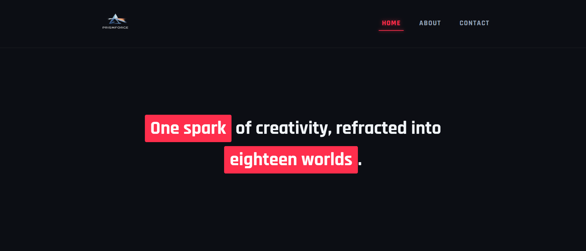
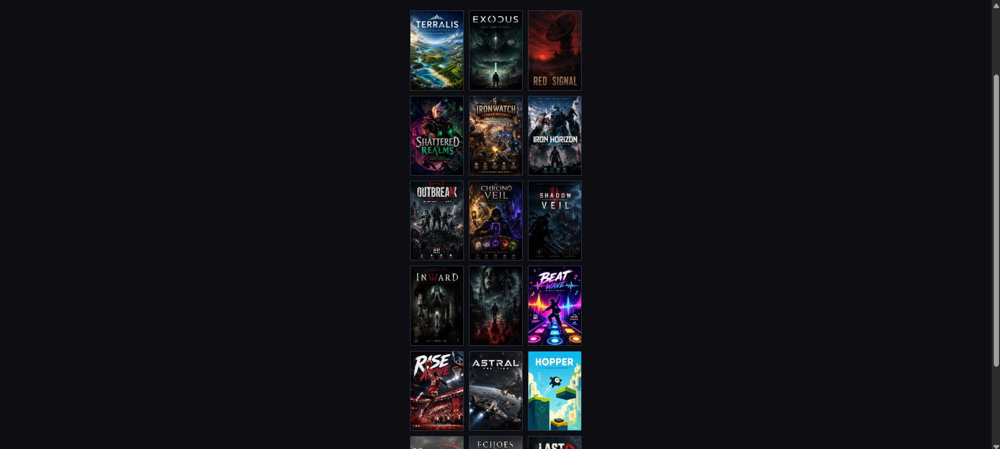
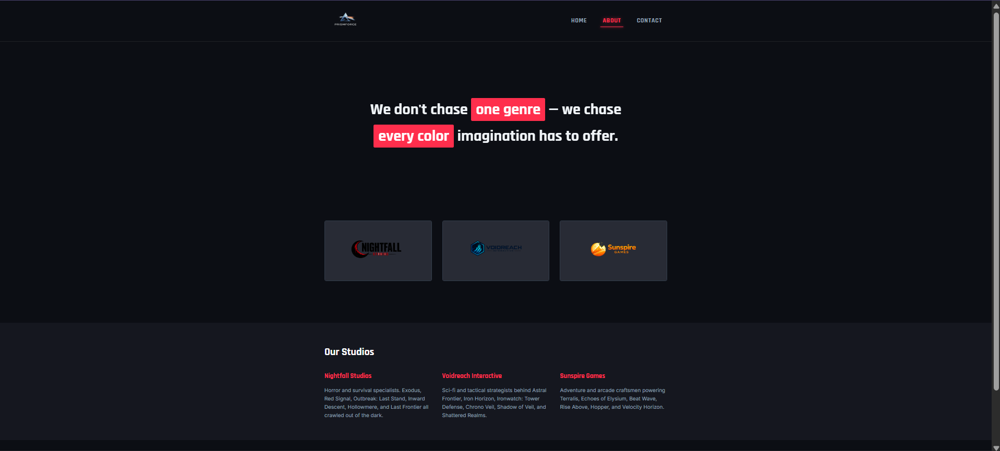
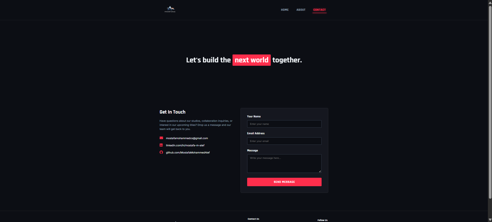
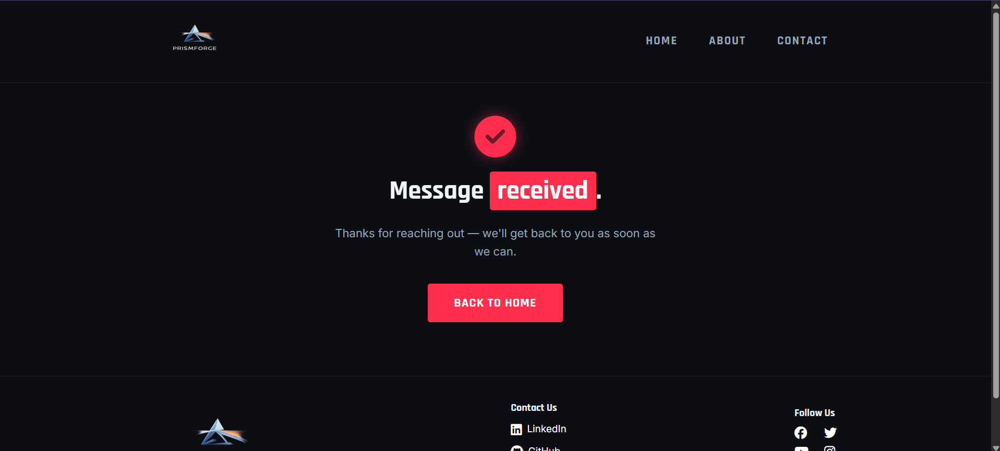

# PrismForge

**One spark of creativity, refracted into eighteen worlds.**

PrismForge is a fictional game-publisher portfolio site built as a frontend design practice project. It showcases three fictional studios and their 18 games through a responsive, animated multi-page site — complete with a working contact form.

🔗 **Live Site:** [prism-forge.netlify.app](https://prism-forge.netlify.app/)

> ⚠️ **Note:** If the live site doesn't load for you, try connecting through a **VPN**. This appears to be a regional network/ISP issue with the `netlify.app` domain rather than a bug in the site itself — the deployment works correctly otherwise.

---

## 📸 Screenshots

### Home — Hero Section



### Home — Games Gallery (18 titles)



### About Page — Studios



### Contact Page



### Contact — Success State



---

## 🎥 Demo Video


---

## ✨ Features

- **Responsive multi-page layout** — Home, About, Contact, and a Thank You confirmation page
- **Animated hero sections** with entrance transitions on each page
- **Interactive game gallery** — hover-dim effect on the grid, with a **lightbox modal** that opens a high-res poster on click (closes via click-outside, close button, or `Esc`)
- **Studio showcase** — three fictional studios (Nightfall Studios, Voidreach Interactive, Sunspire Games) each with their own game roster
- **Working contact form** powered by **Netlify Forms**, redirecting to a custom thank-you page on submit
- **Custom typography** using Google Fonts (`Inter` + `Rajdhani`) and Font Awesome icons
- Fully responsive down to mobile (breakpoint at 768px)

---

## 🛠️ Tech Stack

- **HTML5** — semantic, multi-page structure
- **CSS3** — custom properties, CSS Grid/Flexbox, animations, media queries
- **Vanilla JavaScript** — lightbox gallery logic
- **Netlify** — hosting + form handling (`data-netlify="true"`)
- **Google Fonts** — Inter, Rajdhani
- **Font Awesome 6** — icons (via CDN)

---

## 📁 Project Structure

```
prism-forge/
├── index.html              # Home page (hero + 18-game gallery)
├── about.html               # About page (studio breakdown)
├── contact.html              # Contact form page
├── thank-you.html            # Post-submission confirmation page
├── css/
│   └── style.css             # All site styling
├── js/
│   └── script.js             # Lightbox gallery logic
├── images/                   # Game posters, studio logos, site logo
└── docs/                      # README screenshots
```

---

## 🚀 Running Locally

1. Clone the repo:
   ```bash
   git clone https://github.com/MostafaMohammedAtef/prism-forge.git
   cd prism-forge
   ```
2. Open `index.html` directly in your browser, or serve it locally:
   ```bash
   npx serve .
   ```
3. Navigate to `http://localhost:3000` (or whichever port is shown).

> Note: The contact form relies on Netlify's form-handling backend (`data-netlify="true"`), so form submissions will only work when deployed on Netlify — not when run locally or on another host.

---

## 📬 Contact

- **Email:** mostafamohammedcs@gmail.com
- **LinkedIn:** [linkedin.com/in/mostafa-m-atef](https://linkedin.com/in/mostafa-m-atef)
- **GitHub:** [github.com/MostafaMohammedAtef](https://github.com/MostafaMohammedAtef/)
